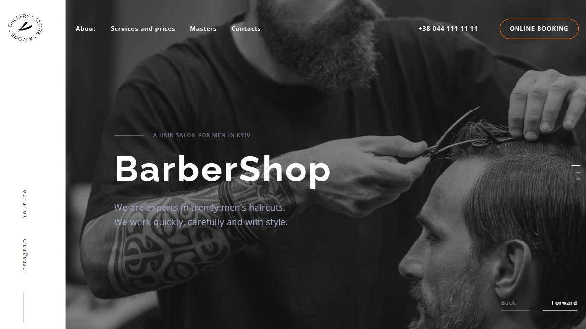

# 💈 Barbershop 

## 🗂️ Project description

### Goals

Implement the Barbershop landing page according to the technical
specifications.

### Used Technologies:

- HTML
- CSS
- SAAS(SCSS)
- JavaScript

### Features

- Layout is made relative to three transition points: 
  - 480px; 
  - 768px; 
  - 1200px;

- BEM methodology to build a website.
- For writing styles, used the Mobile First approach.
